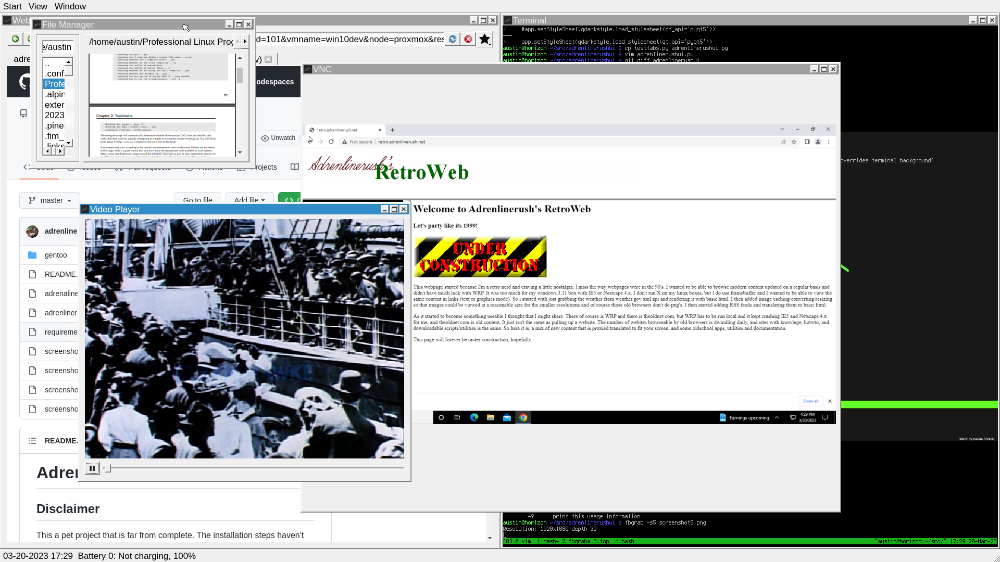

# AdrenlinerushUI

## Disclaimer

This a pet project that is far from complete.  The installation steps haven't been tested and there is still work to be done with packaging and development on the UI itself.  This is just one guy that didn't want to run X or Wayland but still wanted a modern browser and the ability to cut paste between that and the shell.

No Warranty implied or expressed.  

Pull Requests Welcome.

## Known Bugs

VNC Client loses focus preventing keystrokes from making it to the client.  Oddly enough mouse events still work.  Click on another window and click back on it.

## Installation

This has only been tested on a gentoo system.  Included in the gentoo directory is:

- global USE flags for /etc/portage/make.conf
- package specific USE flags /etc/portage/package.use/package.use
- world favorites installed on buid/test system
- mask file with kernel (only running specific version as haven't ported the userspace frambufer patches to a newer kernel for use with fbsplash)
- accept_keywords for a few masked packages being run on the system


### Gentoo

1. add the ebuilds in gentoo/portage_overlay to your local portage overlay
2. emerge --ask adrenlinerushui
3. if you get an error building one of the QT widgets check your qmake symlink, I had to create it
```
austin@mightymouse ~/adrenlinerushUI $ ls -Alh /usr/bin/qmake*
lrwxrwxrwx 1 root root 24 Apr 28 14:39 /usr/bin/qmake -> /usr/lib64/qt5/bin/qmake
lrwxrwxrwx 1 root root 22 Apr 16 13:10 /usr/bin/qmake5 -> ../lib64/qt5/bin/qmake
```
4. . set the Qt Env (putting in .bashrc is a good idea)
```
export QT_QPA_PLATFORM='linuxfb'
export QT_QPA_FB_FORCE_FULLSCREEN='1'
```
5. ensure users are members of input, audio and video groups

### Other Distros - UNTESTED

1. install deps with package manager:
```
PyQt5, acpi, qtcore, qtgui, qtmultimedia, qtprintsupport, qtquickcontrols, qtquickcontrols2, qtwebview, qtermwidget
```
2. pip install https://github.com/adrenlinerush/adrenlinerushUI/releases/download/v0.0.1/adrenlinerushui-0.0.1-py3-none-any.whl
3. set the Qt Env (putting in .bashrc is a good idea)
```
export QT_QPA_PLATFORM='linuxfb'
export QT_QPA_FB_FORCE_FULLSCREEN='1'
```

### Run It

```
adrenlinerushui
```

On any other system you can probably just pip install all the deps and run the script.

## User Guide

- Ctrl+Q - Exit the Application

### Windows

To resize window right click on window bar and select size

View has the ability to tile all open windows or cascad them

You can click the window bar and drack them around

- Alt+T - Tile windows
- Alt+M - Maximize Window
- Alt+R - Restore Window
- Alt+Tab - switch to next window

### Favorties

Favorites are stored in a text file located at ~/.favorites

Format is:
```
%TITLE%=%URL%
```
### Printing

Printing isn't directly supported yet.  I don't print much and can get by using cups lp command.  It supports pdf, images, and text.
```
lp filename
```

The browser supports saving page as PDF with Ctrl+P.  If you want to print something prettier than text write html and save as pdf to print.

### Browser Shortcuts

- Ctrl+P - Saves current tab as PDF
- Ctrl+G - Wipes the text from the URL bar and focus for entry
- Ctrl+T - Open New Tab
- F5 - refresh
- double clicking a tab - opens a new tab
- Ctrl+F - opens search dialog
  - N - Next
  - P - Previous
  - ESC - Exit search

### Media Player

- Ctrl+O - to open a file

### File Manager 

- Allows you to browse a directory.
- Double clicking a directory or .. will refresh with new path
- Double clicking a file will attempt to open in a tab within the File Manager
1. First checks to see if the file is binary or not
2. If not binary opens in vim
3. If binary looks at file ext
4. Opens Images and PDF's with a browser widget
5. Opens Some Media formats with media player


## Screenshots


