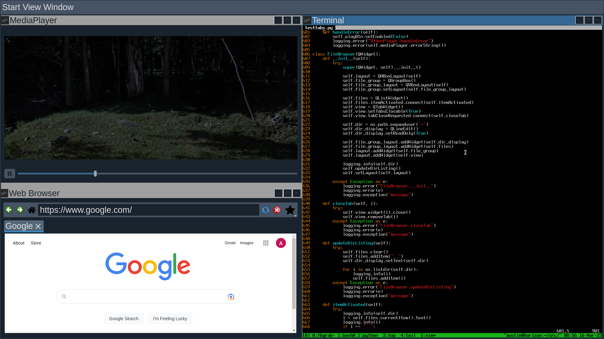
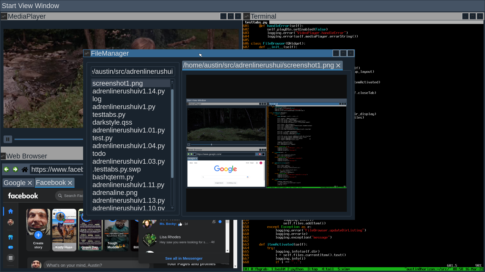
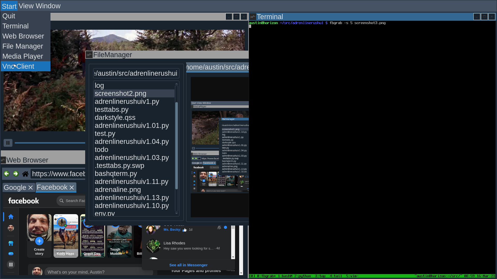
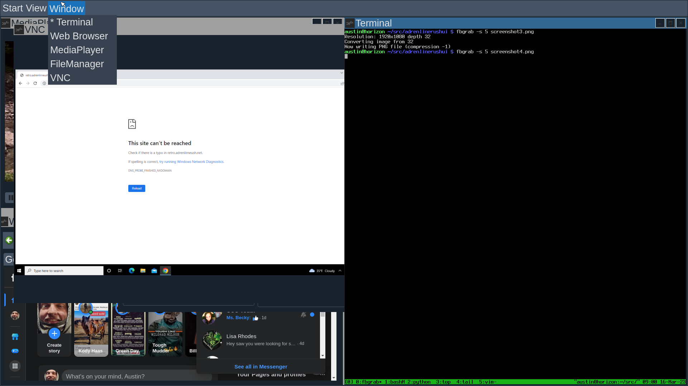

# AdrenlinerushUI

## Disclaimer

This a pet project that is far from complete.  The installation steps haven't been tested and there is still work to be done with packaging and development on the UI itself.  This is just one guy that didn't want to run X or Wayland but still wanted a modern browser and the ability to cut paste between that and the shell.

No Warranty implied or expressed.  

Pull Requests Welcome.

## Todo

- Build pip package
- Create Ebuild for UI
- Create Ebuild for qttermwidget python\sip\bindings
- Create Ebuild for pyQVNCWidget
- Lots of other stuff

## Known Bugs

VNC Client loses focus preventing keystrokes from making it to the client.  Oddly enough mouse events still work.  Click on another window and click back on it.

## Installation

This has only been tested on a gentoo system.  Included in the gentoo directory is:

- global USE flags for /etc/portage/make.conf
- package specific USE flags /etc/portage/package.use/package.use
- world favorites installed on buid/test system
- mask file with kernel (only running specific version as haven't ported the userspace frambufer patches to a newer kernel for use with fbsplash)
- accept_keywords for a few masked packages being run on the system

1. emerge deps

```
emerge dev-python/PyQt5 dev-python/twisted x11-libs/qtermwidget dev-python/qtdarkstyle dev-python/qtawesome
```
2. clone and change to pyqt dir
```
git clone https://github.com/lxqt/qtermwidget.git
cd qtermwidget/pyqt
```
3. modify the sip bindings
```
iff --git a/pyqt/pyproject.toml b/pyqt/pyproject.toml
index 151e202..ee35aef 100644
--- a/pyqt/pyproject.toml
+++ b/pyqt/pyproject.toml
@@ -1,5 +1,4 @@
 # https://www.riverbankcomputing.com/static/Docs/sip/index.html
-
 [build-system]
 requires = ["sip", "PyQt-builder"]
 build-backend = "sipbuild.api"
diff --git a/pyqt/sip/qtermwidget.sip b/pyqt/sip/qtermwidget.sip
index d2523ef..ea61fba 100644
--- a/pyqt/sip/qtermwidget.sip
+++ b/pyqt/sip/qtermwidget.sip
@@ -11,7 +11,7 @@
 class QTermWidget : QWidget {
 
 %TypeHeaderCode
-#include <qtermwidget.h>
+#include <qtermwidget5/qtermwidget.h>
 %End
 
 public:
@@ -41,6 +41,8 @@ public:
     void setTerminalFont(QFont &font);
     QFont getTerminalFont();
     void setTerminalOpacity(qreal level);
+    void setTerminalBackgroundImage(const QString & backgroundImage);
+    void setTerminalBackgroundMode(int);
     void setEnvironment(const QStringList & environment);
     void setShellProgram(const QString & progname);
     void setWorkingDirectory(const QString & dir);
```
4.. compile the sip bindings for qtermwidget
sip-build
sip-install
```
5. get pyQVNCWidget and symlink the qvncwidget subdir to same dir as ui script
```
git clone https://github.com/zocker-160/pyQVNCWidget.git
symlink -s pyQVNCWidget/qvncwidet same/dir/as/adrenlinerushui/ 
```
6. set the Qt Env (putting in .bashrc is a good idea)
```
export QT_QPA_PLATFORM='linuxfb'
export QT_QPA_FB_FORCE_FULLSCREEN='1'
```

At this point you should be able execute the script:
```
python adrenlinerushui.py
```

On any other system you can probably just pip install all the deps and run the script.

## User Guide

### Windows

Switch between windows with Alt+Tab or the Window menu at the top of screen

To resize window right click on window bar and select size

View has the ability to tile all open windows or cascad them

You can click the window bar and drack them around

### Favorties

Favorites are stored in a text file located at ~/.favorites

Format is:
```
%TITLE%=%URL%
```
### Printing

Printing isn't directly supported yet.  I don't print much and can get by using cups lp command.  It supports pdf, images, and text.
```
lp filename
```

The browser supports saving page as PDF with Ctrl+P.  If you want to print something prettier than text write html and save as pdf to print.

### Browser Shortcuts

- Ctrl+P - Saves current tab as PDF
- Ctrl+G - Wipes the text from the URL bar and focus for entry
- double clicking a tab - opens a new tab

### Media Player

- Ctrl+O - to open a file

### File Manager 

- Allows you to browse a directory.
- Double clicking a directory or .. will refresh with new path
- Double clicking a file will attempt to open in a tab within the File Manager
1. First checks to see if the file is binary or not
2. If not binary opens in vim
3. If binary looks at file ext
4. Opens Images and PDF's with a browser widget
5. Opens Some Media formats with media player


## Screenshots





